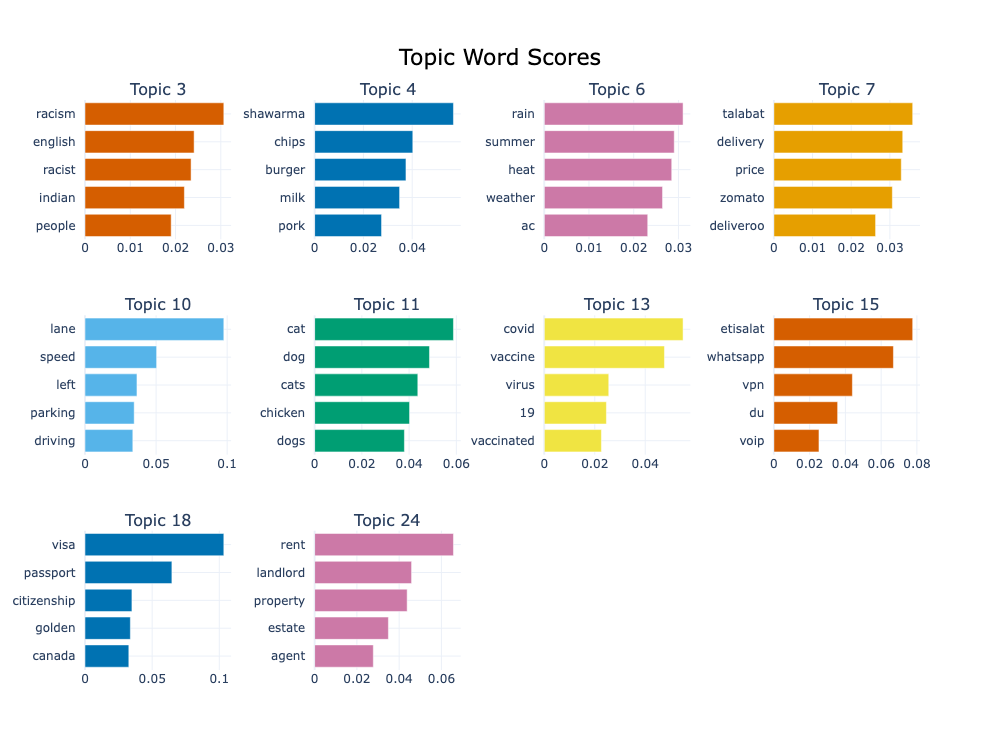

# Topic Modelling Project

Welcome to my topic modelling project. This repository contains everything you need to understand and reproduce the results of my analysis.

## Table of Contents

1. [Introduction](#introduction)
2. [Getting Started](#getting-started)
3. [Methodology](#methodology)
4. [Results](#results)
5. [Visualizations](#visualizations)
6. [Links to Notebooks](#links-to-notebooks)
7. [Contributors](#contributors)
8. [License](#license)

## Introduction

Topic modelling, a crucial text mining technique, is employed in this study to extract major themes from a vast array of documents pertaining to urban life in Dubai. By leveraging techniques such as Latent Dirichlet Allocation (LDA) and BERTopic, and analyzing conversations from the Reddit platform, this research project endeavours to understand Dubai's changing narrative and to evaluate the efficacy of prominent topic modelling methodologies on multi-contextual datasets.   The study delves deep into areas of pre-processing, feature extraction, model development and optimization, and a temporal analysis of the surfaced topics. Key discussions in the results encompass mobility, the COVID-19 pandemic, employment opportunities, immigration, and multicultural relations.   This research underscores the capabilities of topic modelling to decipher regional sentiments and experiences

## Getting Started

### Prerequisites

- LDA models were structured using Python 3.10.1. The specific dependencies for these models can be found in the `lda_env_requirements.txt` file.
- BERTopic models were constructed using Python 3.7.16. Dependencies for these models are enumerated in the `bert_env_requirements.txt` file.

### Installation

1. Clone the [repo](https://github.com/luisanomayo/MSc-Thesis.git)
2. Navigate to the directory
3. Install the required packages in the virtual environments folders

## Methodology

### Dataset and Data Collection
- **Source**: Utilized Reddit’s API with its official API Wrapper (PRAW).
- **Duration**: Extracted data from May to June 2023.
- **Data Points**: Collected 4,255 posts and 129,521 comments.
- **Subreddits Targeted**: r/Dubai, r/DubaiCentral, and r/UAE (only posts mentioning "Dubai").
- **Post Categories**: Acquired 'Hot', 'New', 'Controversial', and 'Top' posts.
- **Data Enhancement**: To improve the data set for topic modelling, comments related to the collected posts were also extracted.
- **Cleaning**: Removed unwanted columns and rows with '[deleted]' or '[removed]' tags, and renamed columns for clarity.

### Test Data Annotation

- **Data Partitioning**: The collected dataset was partitioned into training and test sets. A representative subset of entries from each period present in the dataset was selected using Python's random module for the test set. This ensures that the test data captures the essence and variability of the entire dataset.

- **Manual Topic Labeling**: Before the project's onset, we had identified five broad categories based on a review of related literature and insights from the Vision 2021 UAE National Agenda. As we dove deeper into the data, we refined these themes to capture the actual topics present. This manual interaction and inspection ensured that our machine-generated topics could be verified against human intuition and judgment.

- **Comparison with Machine Learning Models**: The manual labels served as a benchmark to compare against the topics generated by our machine learning models. By aligning these human-generated labels with the machine-generated topics, we could assess the effectiveness and accuracy of our topic models. Discrepancies between the manual labels and model outputs provided insights into areas of improvement and model calibration.

- **Refinement of Themes**: Over the course of interaction with the data, initial themes underwent refinement to better align with the latent topics present in the dataset. This iterative process helped in narrowing down and accurately identifying the predominant topics in the conversations about Dubai.

### Models

#### Latent Dirichlet Allocation (LDA)
- **Pre-processing**: Included text lowercasing, stop words removal, word contractions expansion, special characters removal, lemmatization, and tokenization. Texts shorter than three words were excluded.
- **Data Representation**: Used Gensim's toolkit for topic modelling. Two numerical representations were explored: `doc2bow` and `TF-IDF`. Utilized Phrases module in Gensim to identify bigrams.
- **Models**: Built two LDA models (one with bag-of-words and the other with TF-IDF representation). Explored various numbers of topics (k-values).
- **Evaluation**: Relied on human inspection and evaluation metrics. The BOW model with K=5 topics was found optimal but did not align well with manual annotations.

#### BERTopic
- **Initial Observations**: Issues with word variations, stop words, and classification of data as outliers.

* **Text Pre-processing**: Initial adjustments included stripping URLs, newline characters, tabs, and excessive whitespace. These modifications preserved sentence structure, ensuring optimal model performance.
  
- **Models Used**: A pre-trained BERT model (`all-MiniLM-L6-v2`) from HuggingFace, and a custom-built sentence transformer trained on the dataset.
  |model_no|model_descriptions|
  |--------|------------------|
  |1|all-MiniLM-L6-v2/HDBSCAN/raw_text
  |2|all-MiniLM-L6-v2/HDBSCAN/slightly_prep_text
  |3|all-MiniLM-L6-v2/KMeans/slightly_prep_text
  |4|custom_word2vec_embeddings/HDBSCAN/slightly_prep_text
  
  - **all-MiniLM-L6-v2**:
      * Sourced from the HuggingFace platform.
      * A lightweight version of SBERT (Sentence BERT).
      * Trained on over 1 billion training pairs.
      * Regarded as a general-purpose model.
  
  - **Custom Sentence Transformer**:
      * Exclusively built for this project.
      * Captures specific terms and nuances related to Dubai.
      * Uses word2vec embeddings from the corpus vocabulary.
      * Forms vector representations by averaging embeddings of each word in a document.

  **Sub-models utilized to improve model performance**:
  - **Representation Models**: Integrated within BERTopic to boost term diversity in topics.
  
  - **CountVectorizer**: 
      * Removes common stop words.
      * Restricts training data by focusing on specific word occurrences.
  
  - **HDBSCAN**: BERTopic's default clustering method. Noted for occasionally marking a large data portion as outliers.
  
  - **KMeans Clustering**: Tested as an alternative to HDBSCAN.
  
* **Topic Training Range**: Given our prior manual annotations, our training covered a range of topics, k = [20, 30, 50].

#### Evaluation of BERTopic Models

To assess the efficacy of our BERTopic models, several criteria and steps were undertaken:

- **Objective Measures**: In the absence of built-in evaluation metrics in the BERTopic library, we improvised by using Gensim's coherence and diversity algorithms. Coherence measures the semantic quality of the topics, ensuring the terms within a topic are semantically close. Diversity evaluates the distinctness of terms across various topics.

- **Comparison to Human Judgment**: Before our evaluation phase, we had manually annotated a subset of our dataset to identify distinct topics. This served as a reference for the topic quality generated by our models. 

- **Base Model Performance**: While the base model excelled in terms of topic coherence, its representative terms for topics lacked diversity.

- **Advanced Models' Performance**: Our advanced models, which incorporated additional modules like the MMR model, displayed better performance in terms of topic diversity. Yet, they lagged behind the base model in coherence.

- **Testing on Annotated Data**: To provide a more rigorous quantification of performance, we applied the top-performing variants of our BERTopic models on our manually annotated test set. This comparative analysis aimed to gauge the alignment of the machine-generated topics with human judgment. Given the intricacies of the English language, some topics exhibited varied representative terms across different models. However, after diligent mapping of model-generated topics to our manual annotations, we achieved a satisfactory alignment.

- **Overall Performance Metrics**: Performance on the test dataset was evaluated using an accuracy score. Two specific metrics were calculated: 
    * "Overall Accuracy" which reflected the model's performance across all topics.
    * An average accuracy score considering only the commonly generated topics across the different models.

From our evaluations, some models exhibited superior performance in specific areas. For instance, `model_2` outshined other models in overall accuracy but had a higher percentage of incoherent topics generated. The KMeans clustered model, on the other hand, excelled in topics it had in common with human annotations but faltered in overall accuracy due to a disparity in the total number of topics it generated compared to our manual annotations.

This multi-faceted evaluation process was essential in choosing the best model variant for our subsequent temporal analysis, with `model_2` being our final selection.

## Results

### Overview of Topics Generated by the Models

- The results include common topics consistently identified across all four BERTopic models and unique topics specifically identified by individual models.

### Topic-Term Analysis

- **Diversity and Inclusion (Race)**: Highlighted Dubai's multi-cultural population with terms suggesting racial perceptions and experiences.

- **Real Estate and Housing**: Discusses the essentiality of housing, pointing out processes involved in securing accommodation.

- **Weather Conditions**: Captures Dubai's climatic conditions and interventions like cloud seeding to enhance rainfall.

- **Urban Mobility**: Reflects the experience of commuting in Dubai, touching on road systems, parking, traffic, and driving etiquette.

- **Employment**: Covers aspects of the job market in Dubai, emphasizing the importance of professional experience and the role of luck in job hunting.

- **Sexual Solicitations**: Uncovers the issue of massage cards, a front for illegal activities like prostitution, in Dubai.

- **COVID-19**: Provides an overview of the pandemic's impact and response in Dubai.

- **Food**: Emphasizes Dubai's culinary diversity and the role of food delivery services.

- **Teas**: Highlights the importance and consumption of local beverages like 'karak' and 'chammak'.

- **Financial Services & Fraud**: Points to discussions around credit card scams and illegal attempts to obtain banking details.

- **Entertainment & Media Restrictions**: Emphasizes the regulation of media content in the region.

### Model Selection for Temporal Analysis

- **Model_2** was selected for temporal analysis due to its consistent performance and ability to discern subtle nuances in the data.

### Temporal Analysis

- Insights derived cover:
  - **Topic Popularity**: Based on volume of posts, engagement (comments), and perceived sentiments (upvote ratio).
  - **Topic Consistency**: Identification of recurring topics and one-off discussions.
  - **Peak Analysis**: Identification of periods when specific topics peaked in discussion, and if they correlated to real-world events.
  - **Topic Relationships**: Exploration of topics that were frequently discussed together.

- Noteworthy Findings:
  - **Weather & Animal Welfare**: Both topics peaked during the summer months, coinciding with government campaigns against heat exposure.
  - **Entertainment & Media Restrictions**: High engagement in June 2022 and 2023 due to bans on Hollywood movies.
  - **Driving Experience**: Conversations peaked in January 2023 due to the introduction of new traffic fines in UAE.

- **Sentiment Analysis**: General sentiments associated with key topics were deduced from their upvote ratios. For instance, discussions about food and real estate received neutral responses, while animal welfare and social interactions were viewed more positively.

## Visualizations

## Links to Notebooks

- [Data Preprocessing](https://github.com/yourusername/topic-modelling-project/blob/main/data_preprocessing.ipynb)
- [Model Training](https://github.com/yourusername/topic-modelling-project/blob/main/model_training.ipynb)
- [Results and Visualization](https://github.com/yourusername/topic-modelling-project/blob/main/results_and_visualization.ipynb)

## Contributors

- [Your Name](https://github.com/yourusername)

## License

This project is licensed under the MIT License - see the [LICENSE.md](https://github.com/yourusername/topic-modelling-project/blob/main/LICENSE.md) file for details.
